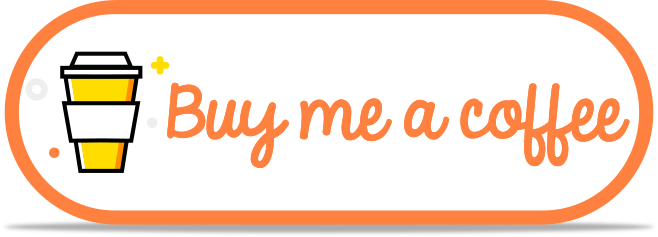

## Hi, I'm Andrew, a Developer💫 from Seattle.

</a>

&nbsp;

<!-- Talking about you -->

**Talking about Personal Stuffs:**

<!-- Any image aligned to the right. Beware the width -->

- 👨🏽‍💻 I’m currently a Front End Developer at Overdose.Digital;
- 😄 Pronouns: he/him/his
- 🌱 Right now I'm learning Next.js and AWS;
- 🐶 I’m probably somewhere with my Boston Terrier Rosie rn;
- 🎶 Fun-Fact: I am a classically trained oboist;
- 💬 I'm happy to chat about pivoting to a tech career;
- 📫 How to reach me: adotterer@gmail.com || [LinkedIn](https://www.linkedin.com/in/adotterer/);
<!-- - 👯 I’m looking to collaborate on ... -->

**Languages and Tools:**

  <!-- Your languages and tools. Be careful with the alignment. 
  You can use this sites to get logos: https://www.vectorlogo.zone or https://simpleicons.org/
  -->

<!-- Your hits or visitors
site: http://hits.dwyl.com or https://visitor-badge.glitch.me
Both apis are in trouble due to the number of requests, if you know any other to register visitors, great
-->

  

  

<!--  -->
